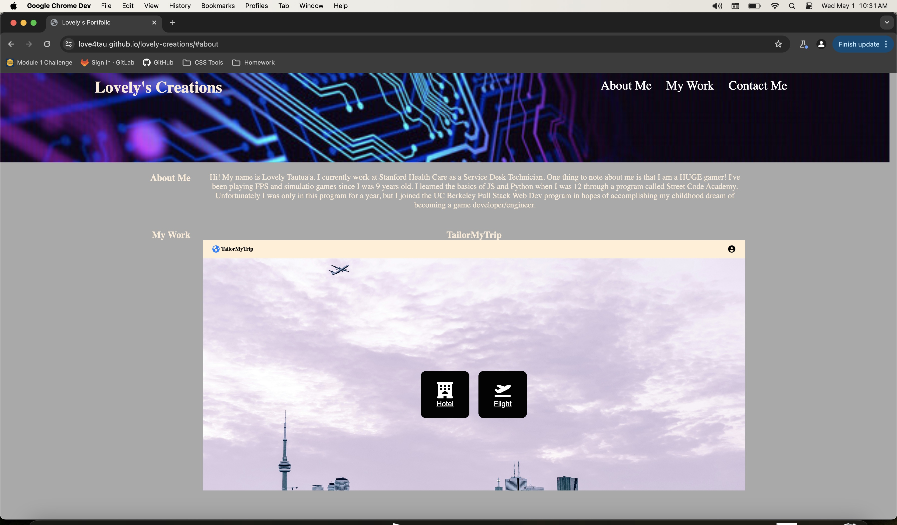

# lovely-creations
This amazing portfolio (created by yours truly) is a collection of the projects I am proud of! 

## Description

The Purpose of creating this portfolio is to showcase the skills/work I've done so far during this bootcamp so that I can make a career change. I've linked the TailorMyTrips website that I built with 5 amazing people and I'm planning on adding more to this website soon!

I learned how to use font awesome to easily create a nice footer with clickable links that route to my social media. I also learned how to make my website more responsive by using media queries to manipulate certain elements to adjust to smaller screens!

## Deployed Application

## Installation

Please click on this link: 

https://love4tau.github.io/lovely-creations/

## License

Did not choose/use a license
